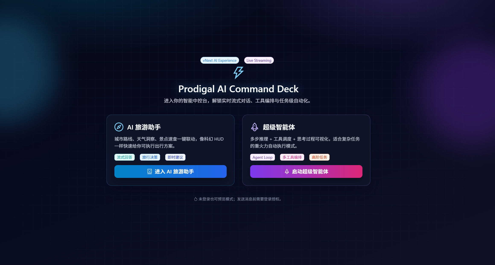
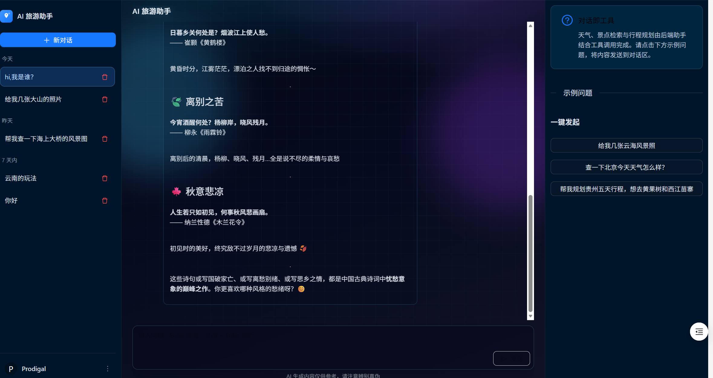
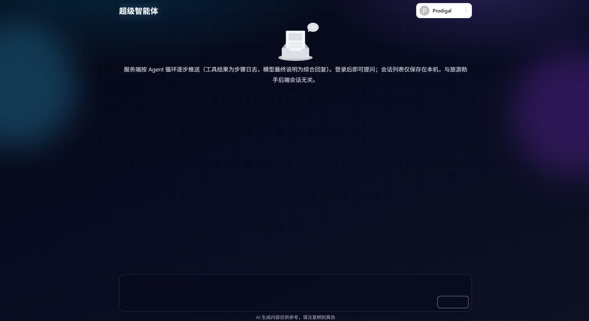

# Prodigal AI Travel

面向国内旅游场景的 AI 对话系统，包含：

- `AI 旅游助手`：行程咨询、天气/搜索工具调用、会话历史
- `超级智能体`：多步 Agent 执行过程流式展示 + 综合回复
- 前后端一体化部署：Spring Boot API + Umi/React Web


<p align="center">
  
  &nbsp;&nbsp;
  
</p>

---

## 1. 项目结构

| 路径 | 说明 |
|---|---|
| `prodigal-travel/` | 后端服务（Spring Boot + Spring AI） |
| `prodigal-travel-web/` | 前端应用（Umi 4 + React + Ant Design） |
| `pom.xml` | 父 POM（Java 21、依赖版本管理、聚合模块） |
| `docker-compose.yml` | 一键启动前后端容器 |
| `Dockerfile` | 后端镜像构建（多阶段 + 健康检查） |

---

## 2. 技术栈

### 后端

- Java 21
- Spring Boot 3.5.x
- Spring AI + Spring AI Alibaba（DashScope）
- MyBatis-Plus + MySQL
- Redis（登录态/JWT 白名单等）
- Knife4j / OpenAPI
- 可选：pgvector（RAG 场景）
- 可选：MCP client（stdio servers）

### 前端

- Node.js >= 18
- Umi 4 / React 18 / Ant Design 5
- Axios + SSE（`fetch` 流式读取）
- React Markdown（展示综合回复）

---

## 3. 核心能力

- **双模式对话**
  - `/chat/travel`：AI 旅游助手
  - `/chat/manus`：超级智能体（步骤日志 + 综合回复）
- **SSE 流式输出**
  - 前端持续接收后端流，支持打字机式呈现
- **工具调用**
  - 搜索、天气、图片、时间、邮件、文件等
- **会话管理**
  - 查询、删除历史会话
- **认证体系**
  - 邮箱验证码注册、账号/验证码登录、退出、注销

---

## 4. 快速开始（本地开发）

## 前置要求

- JDK 21
- Maven 3.8+
- Node.js 18+
- MySQL 8+
- Redis 6+
- DashScope API Key（必需）

## 配置后端

默认读取 `prodigal-travel/src/main/resources/application.yml`，激活 `local`：

- 服务端口：`8088`
- Context Path：`/api`

建议在 `application-local.yml` 中配置（或使用环境变量覆盖）：

- `spring.ai.dashscope.api-key`
- `spring.datasource.url / username / password`
- `spring.data.redis.host / port / password`
- `prodigal.search-api.api-key`（如使用搜索）
- `prodigal.amap.api-key`（如使用高德能力）
- `spring.mail.*`（如使用邮件工具）

## 启动后端

```bash
cd prodigal-travel
mvn spring-boot:run
```

或在根目录：

```bash
mvn -pl prodigal-travel spring-boot:run
```

## 启动前端

```bash
cd prodigal-travel-web
npm install
npm run dev
```

前端默认代理 `/api` 到 `http://localhost:8088`（见 `prodigal-travel-web/config/config.ts`）。

---

## 5. Docker 启动

### 5.1 准备环境变量

复制模板并填写生产配置：

```bash
cp .env.example .env
```

重点必填项：

- `SPRING_DATASOURCE_URL / USERNAME / PASSWORD`
- `SPRING_DATA_REDIS_HOST / PORT / PASSWORD`
- `SPRING_AI_DASHSCOPE_API_KEY`
- `PRODIGAL_JWT_SECRET`
- `SPRING_MAIL_USERNAME / PASSWORD`

### 5.2 构建并启动

项目根目录执行：

```bash
docker compose up -d --build
```

- 前端：`http://localhost`（80）
- 后端：`http://localhost:8088`

说明：

- `docker-compose.yml` 默认只编排前后端容器（不内置 MySQL/Redis）
- MySQL/Redis 可使用外部服务，也可自行扩展 compose 新增容器
- 前端容器通过 Nginx 将 `/api` 反向代理至 `prodigal-api:8088`

### 5.3 运行状态检查

```bash
docker compose ps
docker compose logs -f prodigal-api
curl -X POST http://localhost:8088/api/health/check
```

---

## 6. 主要接口

Base URL：`http://localhost:8088/api`

### 健康检查

- `POST /health/check` -> `OK`

### 认证（无需登录或按接口说明）

- `POST /auth/send-code`
- `POST /auth/register`
- `POST /auth/login`
- `POST /auth/login/by-code`
- `POST /auth/logout`
- `POST /auth/deregister`

### 旅游对话（需 `Authorization: Bearer <token>`）

- `POST /travel/chat`：普通对话
- `POST /travel/chat/sse_emitter`：SSE 流式对话
- `POST /travel/manus/chat`：超级智能体流式执行
- `GET /travel/conversations`：会话列表/详情
- `DELETE /travel/conversations?chatId=...`：删除会话

接口文档（Knife4j）：

- [http://localhost:8088/api/doc.html](http://localhost:8088/api/doc.html)

---

## 7. 前端路由

- `/entry`：模式选择页
- `/chat/travel`：AI 旅游助手
- `/chat/manus`：超级智能体
- `/chat`：重定向到 `/entry`

---

## 8. 开发建议

- 后端新增接口后，可在前端执行：

```bash
cd prodigal-travel-web
npm run openapi2ts
```

- 提交前建议检查：
  - 后端：`mvn test`
  - 前端：`npm run build`

---

## 9. 安全提示（重要）

- 请勿将真实 API Key、数据库密码、邮箱授权码提交到仓库。
- 若你在本地配置文件中已写入真实密钥，建议立即更换为环境变量，并对相关密钥做轮换。
- 推荐将敏感参数统一放入 `.env` / 部署平台密钥管理中。

---

## 10. License

如需开源发布，请补充 `LICENSE` 文件并在此处声明许可协议。
