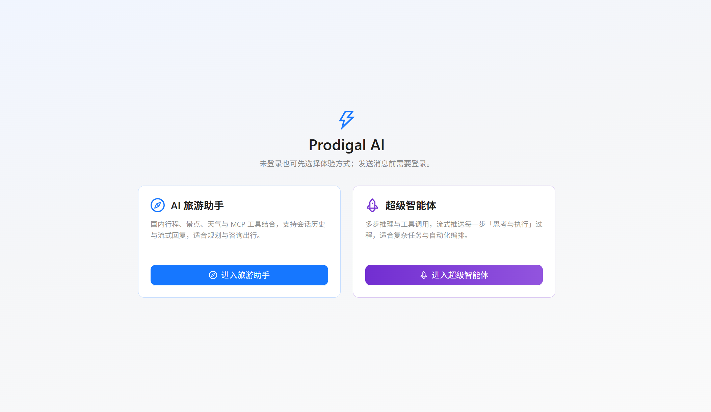
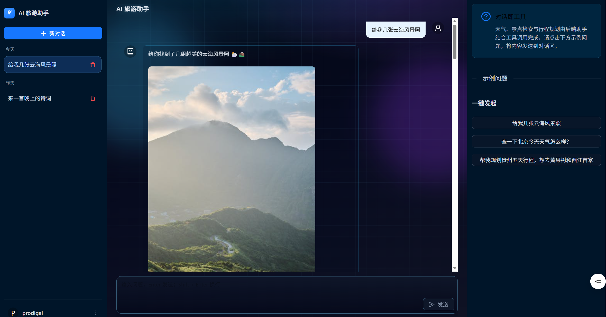

# Prodigal AI Travel（prodigal-ai-travel）

面向中国国内旅游场景的 **AI 旅游助手** 全栈示例：后端基于 **Spring Boot + Spring AI + 阿里云通义（DashScope）**，前端为 **Umi 4 + React + Ant Design** 的对话界面；可选 **PostgreSQL + pgvector** 做向量检索（RAG），并集成 **联网搜索、高德天气、邮件、文件读写** 等工具，以及 **MCP 客户端**（如高德地图 MCP）。

---
界面如图所示

<p align="center">
  
  &nbsp;&nbsp;
  
</p>

## 仓库结构

| 目录 | 说明 |
|------|------|
| `prodigal-travel/` | Maven 子模块：Spring Boot 后端（主 POM 中已声明） |
| `prodigal-travel-web/` | 前端工程（独立 npm 项目，与后端同仓部署） |
| 根目录 `pom.xml` | 父 POM：`dependencyManagement` 与 `prodigal-travel` 模块 |

---

## 技术栈

**后端**

- Java 21、Spring Boot 3.5.x  
- **Spring AI Alibaba**（通义对话与 Embedding）  
- **spring-ai-starter-vector-store-pgvector**（向量库，需 PostgreSQL 启用 `vector` 扩展）  
- Knife4j / OpenAPI 3 接口文档  
- Hutool、POI、Redis 缓存、Spring Mail  

**前端**

- Node.js ≥ 18  
- Umi 4、React 18、Ant Design 5  
- `react-markdown` 等用于消息展示  

---

## 核心能力

1. **对话与记忆**  
   使用 `MessageChatMemoryAdvisor` 按 `chatId` 维护多轮上下文（见 `TravelAiClient`）。

2. **系统人设与约束**  
   旅游垂直助手「乖哈baby」：非旅游问题拒答、优先工具取实时信息。

3. **工具调用（Spring AI `@Tool`）**  
   在 `ToolRegisterConfig` 中注册，主要包括：
   - **联网搜索**：SearchAPI
   - **天气**：高德 Web 服务（`prodigal.amap.api-key`）  
   - **邮件**：SMTP
   - **当前时间**
   - **文件读写**

4. **RAG（可选扩展）**  
   项目内已实现查询重写、自定义检索顾问、`TravelKnowledgeLoader` 等；`TravelAiClient#doChatWithRag` 为带 pgvector 的对话路径。**当前对外接口** `POST /travel/chat` 使用的是 `doChat`（记忆 + 工具）。若需上线 RAG，可在控制器中改为调用 `doChatWithRag` 或增加新路由。

5. **MCP**  
   使用stdio 方式：执行图片搜索能力

---

## 环境要求

- JDK 21、Maven 3.8+  
- PostgreSQL（使用向量能力时需安装 **pgvector** 扩展）  
- 通义 **DashScope API Key**  
- 可选：SearchAPI Key、高德 Key、SMTP、Node（MCP）

---

## 配置说明

后端默认 **`server.port=8088`**，**`server.servlet.context-path=/api`**（见 `application.yml`）。

请在本地使用 **`application-local.yml`** 或环境变量覆盖敏感信息，**不要将真实 Key、数据库密码提交到版本库**。至少需要配置：

- `spring.ai.dashscope.api-key`：通义 API Key  
- `spring.datasource.*`：PostgreSQL 连接（若使用向量库/RAG 相关能力）  
- `prodigal.search-api.api-key`、`prodigal.amap.api-key`：搜索与天气  
- `spring.mail.*`：发信（若使用邮件工具）  

激活的 Spring Profile 默认为 `local`（`spring.profiles.active: local`）。

---

## 构建与运行

**后端**（在仓库根目录或 `prodigal-travel` 目录执行）：

```bash
cd prodigal-travel
mvn spring-boot:run
```

或先在根目录：

```bash
mvn -pl prodigal-travel spring-boot:run
```

**前端**（开发模式，代理到后端 `http://localhost:8088`）：

```bash
cd prodigal-travel-web
npm install
npm run dev
```

`prodigal-travel-web/config/config.ts` 中已将 `/api` 代理到本机 8088，与后端 `context-path=/api` 一致。

**生产构建前端**：

```bash
cd prodigal-travel-web
npm run build
```

---

## 主要 HTTP 接口

| 方法 | 路径 | 说明 |
|------|------|------|
| POST | `/api/travel/chat` | 旅游助手对话；请求头 **`X-User-Id`**（用户标识）；Body：`{ "message": "...", "chatId": "可选，不传则新建会话" }` |
| POST | `/api/health/check` | 健康检查，返回 `OK` |

**接口文档（Knife4j）**：启动后端后访问  
`http://localhost:8088/api/doc.html`

---

## 相关包与类（便于二次开发）

- 入口：`com.prodigal.travel.ProdigalAiTravelApplication`  
- 对话入口：`TravelAssistantController` → `TravelAiClient`  
- RAG：`com.prodigal.travel.rag.*`  
- 工具：`com.prodigal.travel.tools.*`、`ToolRegisterConfig`  
- 全局异常：`GlobalExceptionHandler`  

---

## 版本

- 父 POM / 模块版本：`1.0.0`（`prodigal-version`）  

---

## 许可证

若需对外分发，请在仓库中补充 `LICENSE` 并与此 README 保持一致。
